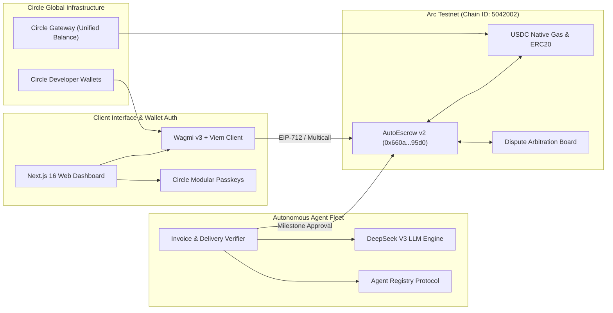
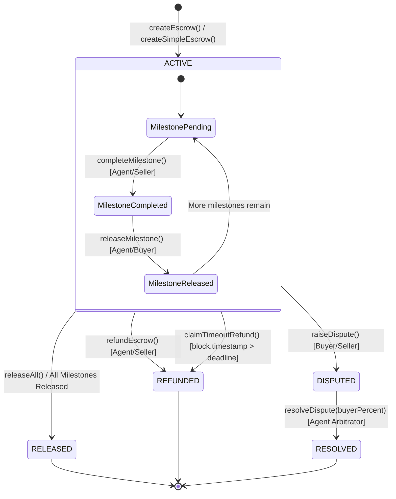
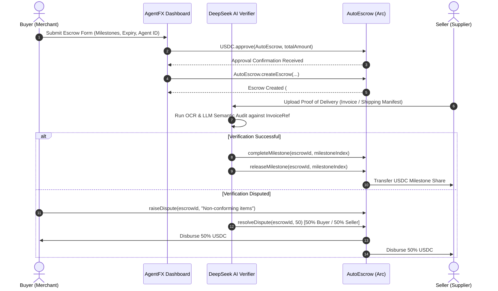
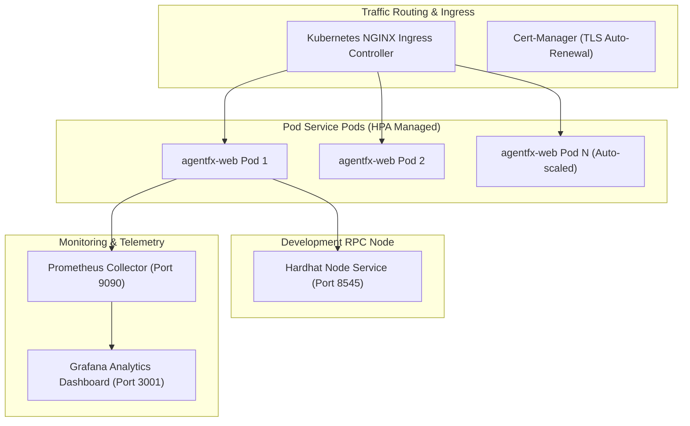

# AgentFX — Autonomous Treasury & AI Settlement OS

> **Enterprise-grade, AI-verified programmable escrow and cross-border settlement infrastructure natively powered by USDC on Arc Network.**

[-0052FF?style=flat-square&logo=ethereum)](https://arc.network)
[](https://circle.com)
[](https://nextjs.org)
[](https://soliditylang.org)
[](https://deepseek.com)
[](https://circle.com)

---

## 1. System Blueprint & Core Philosophy

**AgentFX** (also known as **Meridian Treasury OS**) resolves the operational friction, counterparty risk, and settlement latencies inherent in international B2B commerce. By integrating **Arc Network's sub-second finality**—where **USDC serves as the native gas token**—with autonomous AI verification agents, AgentFX transforms static financial agreements into dynamic, machine-executable escrow contracts.

```
                  ┌─────────────────────────────────────────────────────────┐
                  │                 AGENTFX PLATFORM MATRIX                 │
                  └─────────────────────────────────────────────────────────┘
        ┌───────────────────────┐         ┌───────────────────────┐         ┌───────────────────────┐
        │  AUTONOMOUS AGENTS    │         │ ON-CHAIN STATE ENGINE │         │ CIRCLE INFRASTRUCTURE │
        ├───────────────────────┤         ├───────────────────────┤         ├───────────────────────┤
        │ • DeepSeek V3 Specs   │         │ • Milestone Escrow    │         │ • Circle Gateway      │
        │ • Invoice Verification│  ─────► │ • Auto-Refund Timers  │  ─────► │ • Modular Passkeys    │
        │ • Dispute Arbitration │         │ • Multicall Batching  │         │ • Unified USDC Vault  │
        └───────────────────────┘         └───────────────────────┘         └───────────────────────┘
```

> [!IMPORTANT]
> Unlike traditional smart contract platforms requiring users to hold volatile gas assets (e.g., ETH, MATIC), **AgentFX operates natively on Arc Network**, using USDC for both escrow collateral and transaction gas fees. This enables zero-fx friction and predictable micro-penny settlement costs.

---

## 2. Platform Topology & Verification Engine

The architecture connects frontend web clients, AI agent fleets, Circle cross-chain liquidity rails, and on-chain EVM smart contracts deployed on Arc Testnet.



### Core Architectural Layers

1. **Client Interface Layer**: Built with **Next.js 16**, **Wagmi v3**, **Viem**, and **Tailwind CSS v4**. Implements reactive state polling, SSR-safe QueryClient hooks, and toast-driven multi-step transaction pipelines.
2. **Autonomous Agent Fleet**: Powered by **DeepSeek V3**, evaluating off-chain invoice references, PO receipts, and shipping manifests to automatically trigger contract milestone releases without human intervention.
3. **On-Chain Settlement Engine**: Solidity `AutoEscrow` smart contract managing multi-milestone lockups, automated deadline refunds, reentrancy guards, and percentage-based dispute resolution.
4. **Unified Liquidity & Auth**: **Circle Gateway** enables instant (<500ms) cross-chain USDC deposits across 11+ EVM networks and Solana, routing funds directly into Arc's native gas environment.

---

## 3. On-Chain Escrow State Machine & Smart Contracts

The centerpiece of AgentFX's contract layer is `AutoEscrow.sol`, deployed on **Arc Testnet** at `0x660a83A3B4dB4455E23eE51F74CC0f7f60b395d0`.

### Escrow Life Cycle State Machine



### Smart Contract Specification (`AutoEscrow.sol`)

| Function | Access Control | Reentrancy Guard | Description |
| :--- | :--- | :---: | :--- |
| `createEscrow(...)` | Public | `Yes` | Lock USDC, define milestone array, assign AI agent & set expiry timestamp |
| `createSimpleEscrow(...)` | Public | `Yes` | Single-step quick escrow with default 30-day auto-refund deadline |
| `completeMilestone(...)` | `Agent` or `Seller` | `No` | Attests that a specific delivery milestone has been fulfilled |
| `releaseMilestone(...)` | `Agent` or `Buyer` | `Yes` | Disburses milestone-allocated USDC directly to the seller |
| `releaseAll(...)` | `Agent` or `Buyer` | `Yes` | Instantly releases 100% of remaining locked escrow balance |
| `refundEscrow(...)` | `Agent` or `Seller` | `Yes` | Returns remaining locked funds to the buyer prior to deadline |
| `claimTimeoutRefund(...)` | Public (Anyone) | `Yes` | Permissionless auto-refund executed if `block.timestamp > deadline` |
| `raiseDispute(...)` | `Buyer` or `Seller` | `No` | Freezes active escrow into `DISPUTED` state upon counterparty conflict |
| `resolveDispute(...)` | `Agent` Only | `Yes` | Arbitrates dispute by splitting funds according to `buyerPercent` (0-100%) |

> [!NOTE]
> All read operations on the frontend dashboard query contract state using **multicall batching (`client.multicall()`)**, reducing RPC network overhead from $N$ sequential round-trips to a single batched payload.

---

## 4. Multi-Agent Verification & Data Flow

### Transaction & Verification Sequence



---

## 5. Distributed Infrastructure & Kubernetes Topology

AgentFX is engineered for mission-critical reliability, leveraging microservices, containerization, and real-time observability stacks.



### Containerization & Cloud-Native Deployment Options

#### 1. Docker Compose Stack (`docker-compose.yml`)

The local composition orchestrates 4 synchronized services:

```yaml
services:
  web:           # Next.js 16 Production Web Container (Port 3000)
  hardhat-node:  # Local EVM Testing Node (Port 8545)
  prometheus:    # Real-time Metrics Harvester (Port 9090)
  grafana:       # Enterprise Observability Visualizer (Port 3001)
```

#### 2. Enterprise Kubernetes Engine (`/kubernetes`)

Production manifests provide horizontal scalability and self-healing deployment topologies:

| Kubernetes Manifest | API Version | Purpose |
| :--- | :--- | :--- |
| `deployment.yaml` | `apps/v1` | Manages containerized replicas with rolling update strategy & readiness probes |
| `hpa.yaml` | `autoscaling/v2` | Horizontal Pod Autoscaler scaling pods from 2 to 10 based on CPU/Memory thresholds |
| `ingress.yaml` | `networking.k8s.io/v1` | TLS-terminated ingress routing for production domain endpoints |
| `service.yaml` | `v1` | ClusterIP service exposing internal pod traffic to cluster routing |
| `configmap.yaml` | `v1` | Non-sensitive runtime variables and RPC configuration mappings |
| `secret.yaml` | `v1` | Encrypted secrets store for API keys, private keys, and session passphrases |

---

## 6. Local Bootstrap & Operational Workflows

### Prerequisites

- **Node.js**: `v18.x` or `v20.x`
- **Package Manager**: `npm` or `pnpm`
- **Docker Engine & Docker Compose** (optional for containerized deployment)

### 1. Environment Setup

Copy `.env.example` files across contracts and web components:

```bash
# Clone the repository
git clone https://github.com/your-org/track-4-AgentFX.git
cd track-4-AgentFX

# Setup root environment variables
cp .env.example .env

# Setup Web Application environment variables
cp web/.env.example web/.env.local
```

Ensure environment configuration parameters are set in `web/.env.local`:

```env
NEXT_PUBLIC_ARC_TESTNET_RPC_URL=https://rpc.testnet.arc.network
NEXT_PUBLIC_AUTO_ESCROW_ADDRESS=0x660a83A3B4dB4455E23eE51F74CC0f7f60b395d0
CIRCLE_API_KEY=your_circle_api_key_here
DEEPSEEK_API_KEY=your_deepseek_api_key_here
ENCRYPTION_KEY=meridian-default-vault-passphrase-2026
```

### 2. Smart Contract Compilation & Deployment

```bash
cd contracts

# Install Hardhat dependencies
npm install

# Compile Solidity contracts
npx hardhat compile

# Deploy to Arc Testnet
node deploy.mjs
```

### 3. Web Dashboard Local Development

```bash
cd ../web

# Install web dependencies
npm install

# Start Next.js development server
npm run dev
```

Open [http://localhost:3000](http://localhost:3000) in your browser.

### 4. Running Full Stack via Docker Compose

```bash
# Launch Next.js web app, Hardhat node, Prometheus, and Grafana simultaneously
docker-compose up --build -d

# Verify service health
docker-compose ps
```

Access services at:
- **AgentFX Web Application**: `http://localhost:3000`
- **Grafana Dashboard**: `http://localhost:3001` (Credentials: `admin` / `admin`)
- **Prometheus Engine**: `http://localhost:9090`

---

## 7. Security, Trust Model & Compliance Guardrails

```
                    ┌──────────────────────────────────────────────┐
                    │      MULTI-LAYERED TRUST & SECURITY          │
                    └──────────────────────────────────────────────┘
                                           │
         ┌─────────────────────────────────┼─────────────────────────────────┐
         ▼                                 ▼                                 ▼
┌──────────────────┐             ┌──────────────────┐             ┌──────────────────┐
│ CONTRACT SAFETY  │             │   AUTH SAFETY    │             │ COMPLIANCE ENGINE│
├──────────────────┤             ├──────────────────┤             ├──────────────────┤
│ Reentrancy Guards│             │ Circle WebAuthn  │             │ Real-time OFAC/  │
│ Strict Timeouts  │             │ Passkey HSM Keys │             │ AML API Screening│
│ State Lockouts   │             │ Zero Private Key │             │ Auto Transaction │
│ Explicit Approves│             │ Exposure         │             │ Freezes          │
└──────────────────┘             └──────────────────┘             └──────────────────┘
```

> [!WARNING]
> **Production Guardrails**: All transactions originating from the AgentFX front end undergo pre-flight compliance validation via the `/api/compliance/check` endpoint. Any wallet address flagged for sanction mismatches or illicit activity is dynamically barred from contract execution.

### Defensive Mechanisms

1. **Reentrancy Protection**: All state-modifying contract functions (`releaseMilestone`, `releaseAll`, `refundEscrow`, `resolveDispute`) implement an explicit `nonReentrant` mutex guard.
2. **Cryptographic Key Isolation**: Agent actions and wallet operations utilize Circle's Hardware Security Module (HSM) MPC key shards, ensuring private keys are never exposed in browser memory or database storage.
3. **Autonomous Dispute Arbitration**: In cases where buyer and seller reach an impasse, the assigned AI agent operates as an immutable on-chain arbitrator, dividing locked escrow funds with explicit precision.

---

## 8. Interface Endpoints & Microservice Routing

| Route Endpoint | HTTP Method | Core Functionality |
| :--- | :---: | :--- |
| `/api/agent` | `POST` | Invokes DeepSeek V3 agent verification pipeline for invoice validation |
| `/api/circle-session` | `POST` | Generates ephemeral session tokens for Circle Developer & Modular Wallets |
| `/api/compliance/check` | `GET` | Executes real-time address screening against compliance & sanctions lists |
| `/api/payouts` | `POST` | Initiates automated batch payouts to supplier accounts upon milestone fulfillment |
| `/api/sponsor` | `POST` | Dispatches gasless transaction sponsorships via Arc native gas rails |
| `/api/metrics` | `GET` | Exposes Prometheus-formatted operational metrics (TVL, Escrow counts, latency) |

---

## License & Attribution

Distributed under the **MIT License**. See `LICENSE` for full terms.
