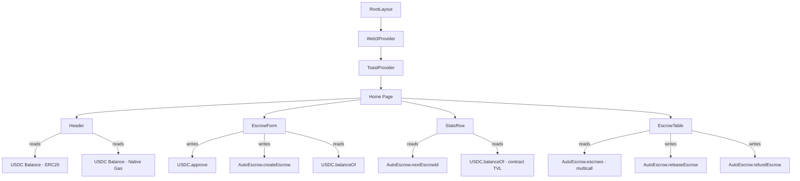
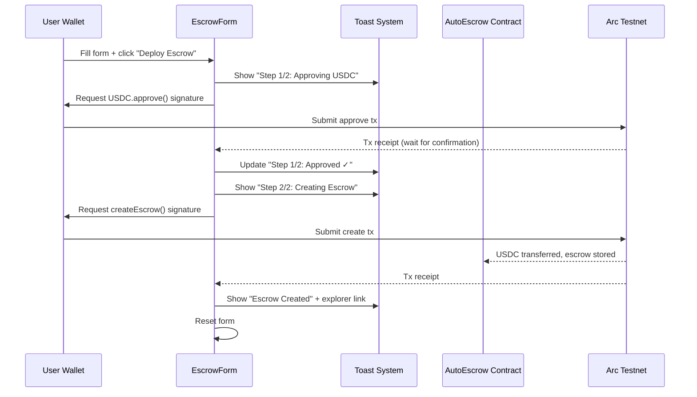

# Meridian Treasury OS — Architecture Documentation

## Project Overview

**Meridian** is an AI-native treasury and settlement operating system for cross-border B2B commerce, built on **Arc Network** where **USDC is the native gas token**.

- **Smart Contract:** `AutoEscrow` deployed at `0x660a83A3B4dB4455E23eE51F74CC0f7f60b395d0`
- **Chain:** Arc Testnet (Chain ID `5042002`)
- **Stack:** Next.js 16 + Wagmi 3 + Viem + Tailwind v4

---

## File Structure

```
track-4-AgentFX/
├── contracts/                    # Smart contract layer
│   ├── contracts/AutoEscrow.sol  # Core escrow contract
│   ├── deploy.mjs               # Compile + deploy script
│   ├── hardhat.config.js         # Hardhat configuration
│   └── .env                      # Private key (gitignored)
│
└── web/                          # Frontend application
    └── src/
        ├── app/
        │   ├── layout.tsx        # Root layout (providers, metadata)
        │   ├── page.tsx          # Dashboard composition
        │   └── globals.css       # Design system tokens + base styles
        │
        ├── components/
        │   ├── Web3Provider.tsx   # Wagmi + React Query setup
        │   ├── Header.tsx        # Navigation, wallet, balances
        │   ├── EscrowForm.tsx    # Create escrow (approve→lock flow)
        │   ├── EscrowTable.tsx   # On-chain escrow list + actions
        │   ├── StatsRow.tsx      # TVL, count, yield (live data)
        │   └── ui/
        │       └── Toast.tsx     # Notification system
        │
        └── lib/
            └── constants.ts      # Chain config, ABIs, helpers
```

---

## Component Hierarchy



---

## Transaction Lifecycle



---

## Data Flow — On-Chain Reads

| Component | Contract Call | Refresh Interval |
|-----------|-------------|-----------------|
| `Header` | `USDC.balanceOf(user)` | 10s |
| `Header` | Native balance (gas) | 10s |
| `StatsRow` | `AutoEscrow.nextEscrowId()` | 15s |
| `StatsRow` | `USDC.balanceOf(contract)` — TVL | 15s |
| `EscrowForm` | `USDC.balanceOf(user)` | 10s |
| `EscrowTable` | `AutoEscrow.escrows(i)` via multicall | 12s |

---

## Design System Tokens

All defined in `globals.css`:

| Token | Value | Usage |
|-------|-------|-------|
| `--bg-primary` | `#0b0c10` | Page background |
| `--bg-surface` | `rgba(17,19,26,0.6)` | Card backgrounds |
| `--bg-input` | `#070810` | Input fields |
| `--text-primary` | `#f1f5f9` | Main text |
| `--text-secondary` | `#94a3b8` | Secondary text |
| `--text-accent` | `#22d3ee` | Cyan highlights |
| `--accent-cyan` | `#22d3ee` | Primary accent |
| `--accent-green` | `#34d399` | Success states |
| `--accent-red` | `#f87171` | Error states |
| `--glow-cyan` | `0 0 20px rgba(...)` | Card glow effect |

---

## Key Design Decisions

1. **Typed ABI in constants.ts** — Using `as const` assertions for full wagmi type inference, eliminating the need for separate JSON ABI files.

2. **SSR-safe QueryClient** — Created inside `useState()` to prevent React hydration mismatches, following wagmi v2+ best practices.

3. **Multicall for escrow reads** — Instead of N sequential RPC calls, the table uses `client.multicall()` to batch all escrow reads into a single RPC request.

4. **Two-phase transaction flow** — Approve is explicitly awaited before createEscrow is called, preventing the race condition that would cause on-chain reverts.

5. **Toast-based notifications** — Replaceable, updateable toasts with unique IDs allow the multi-step flow to transform a "loading" toast into a "success" toast with an explorer link.
