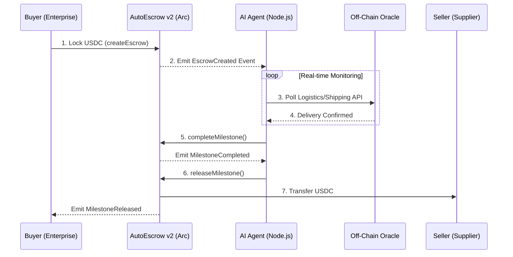

# Meridian — Treasury OS

> AI-native autonomous treasury and settlement operating system for cross-border B2B commerce.  
> Built on Arc Network where USDC is the native gas token.

**Track 4: Best Agentic Economy Experience on Arc**

---

## Overview

Meridian is an enterprise-grade treasury management platform that combines programmable escrow, autonomous policy engines, and real-time settlement infrastructure to solve the working capital inefficiency problem in cross-border B2B commerce.

Unlike typical crypto payment apps, Meridian operates as a **Treasury Operating System** — a thin automation layer that sits between a company's finance operations and the blockchain, making USDC flow according to business rules without manual intervention.

### Core Problem

In B2B cross-border trade, capital is trapped for days in escrow, clearing houses, and reconciliation queues. This idle capital costs businesses thousands in opportunity cost. Meridian eliminates this by:

1. **Agent-verified escrow** — USDC locked in smart contracts, released automatically by AI agents upon delivery verification
2. **Treasury policy engine** — Configurable rules that automate capital routing (sweep excess to yield, reserve guards, scheduled payouts)
3. **Zero-overhead settlement** — Gas fees paid in USDC (no volatile token exposure), sub-second finality

---

## Architecture



---

## Circle Products Used

| Product | Integration | Description |
|---------|------------|-------------|
| **USDC** | Active | Primary settlement rail. Native gas token on Arc. Used for escrow deposits, transfers, and treasury routing. |
| **CCTP v2** | Architectural | Cross-chain USDC bridging from Ethereum/other chains to Arc. Bridge tab with protocol documentation. |
| **App Kit** | Integrated | Unified balance aggregation across ERC-20 and native USDC interfaces on Arc. |
| **Circle Wallets** | Planned | Embedded wallet UX for non-crypto-native enterprise users. Architecture designed for integration. |
| **Gateway** | Planned | Backend liquidity routing for agent-orchestrated multi-party settlements. |
| **Nanopayments** | Planned | Micro-transaction support for pay-per-inference AI agent billing. |

---

## Features

### 1. Agentic Escrow v2 (On-Chain)
- Buyer locks USDC into `AutoEscrow v2` smart contract
- **Milestone-based releases** — split escrow into deliverables, release funds per milestone
- **Deadline auto-refund** — if seller doesn't deliver by deadline, buyer can claim timeout refund
- **Dispute resolution** — buyer/seller can raise dispute, agent arbitrates with percentage split
- Designated AI agent address can release funds upon delivery verification
- Real 2-step transaction flow: Approve → Lock (with confirmation wait)
- Full input validation, multi-step progress, explorer links
- 5-state escrow lifecycle: ACTIVE → RELEASED / REFUNDED / DISPUTED → RESOLVED

### 2. USDC Payments
- **Send**: Real ERC-20 USDC transfers on Arc Testnet
- **Bridge**: CCTP v2 cross-chain architecture with protocol details
- **Faucet**: Direct integration with Circle's testnet faucet

### 3. Treasury Policy Engine
- Configurable rules: threshold sweeps, scheduled payouts, reserve guards
- Toggle-based activation for each policy
- Real on-chain treasury transfer execution panel
- Designed for AI agent autonomous execution

### 4. On-Chain Activity Log
- Reads all contract events (Created, Released, Refunded, Disputed, Resolved) from chain
- Real-time timeline feed with auto-refresh
- Transaction links to ArcScan explorer

### 5. Real-Time Dashboard
- On-chain TVL (reads contract USDC balance)
- Live escrow count (from `nextEscrowId`)
- Projected yield counter (calculated from actual TVL at 5.1% APY)
- Dual USDC balance display (ERC-20 + native gas)

---

## Technical Stack

| Layer | Technology |
|-------|-----------|
| Frontend | Next.js 16, React 19, TypeScript |
| Web3 | Wagmi 3, Viem 2 |
| Styling | Tailwind CSS v4 |
| Smart Contract | Solidity 0.8.24 |
| Chain | Arc Testnet (5042002) |
| Icons | Lucide React |
| Data | On-chain reads via multicall |

---

## Setup

### Prerequisites
- Node.js 18+
- MetaMask or compatible wallet
- Arc Testnet USDC (from [faucet.circle.com](https://faucet.circle.com))

### Install & Run

```bash
# Clone
git clone <repository-url>
cd track-4-AgentFX

# Frontend
cd web
npm install
npm run dev
# → http://localhost:3000

# Smart Contract (already deployed)
cd ../contracts
npm install
node deploy.mjs  # Only if redeploying
```

### Wallet Configuration

Add Arc Testnet to MetaMask:
- **Network Name**: Arc Testnet
- **RPC URL**: `https://rpc.testnet.arc.network`
- **Chain ID**: `5042002`
- **Currency**: USDC
- **Explorer**: `https://testnet.arcscan.app`

---

## Smart Contract

**AutoEscrow v2** — deployed at [`0x08818076dCDbFe5b6ca0e4471c1fF8b11e568774`](https://testnet.arcscan.app/address/0x08818076dCDbFe5b6ca0e4471c1fF8b11e568774)

### Core Functions
| Function | Access | Description |
|----------|--------|-------------|
| `createSimpleEscrow(seller, agent, amount)` | Anyone | Quick escrow with 30-day deadline |
| `createEscrow(seller, agent, deadline, ref, milestoneDescs, milestoneAmounts)` | Anyone | Full escrow with milestones |
| `completeMilestone(escrowId, milestoneIndex)` | Agent or Seller | Mark milestone as done |
| `releaseMilestone(escrowId, milestoneIndex)` | Agent or Buyer | Release milestone funds to seller |
| `releaseAll(escrowId)` | Agent or Buyer | Release all remaining funds |
| `refundEscrow(escrowId)` | Agent or Seller | Refund remaining to buyer |
| `claimTimeoutRefund(escrowId)` | Anyone (after deadline) | Auto-refund on deadline expiry |
| `raiseDispute(escrowId, reason)` | Buyer or Seller | Freeze escrow for dispute |
| `resolveDispute(escrowId, buyerPercent)` | Agent only | Split remaining funds to resolve |

### State Machine
```
ACTIVE → RELEASED (via releaseAll/releaseMilestone)
ACTIVE → REFUNDED (via refundEscrow/claimTimeoutRefund)
ACTIVE → DISPUTED (via raiseDispute)
DISPUTED → RESOLVED (via resolveDispute)
```

### Events
- `EscrowCreated(escrowId, buyer, seller, agent, totalAmount, deadline)`
- `MilestoneCompleted(escrowId, milestoneIndex, completedBy)`
- `MilestoneReleased(escrowId, milestoneIndex, amount)`
- `EscrowFullyReleased(escrowId, totalAmount)`
- `EscrowRefunded(escrowId, amount)`
- `DisputeRaised(escrowId, raisedBy, reason)`
- `DisputeResolved(escrowId, buyerAmount, sellerAmount)`

---

## Circle Product Feedback

### Why These Products

We chose USDC on Arc as the foundation because B2B enterprises cannot use volatile tokens for treasury operations. The fact that USDC is the native gas token on Arc eliminates a fundamental adoption barrier: companies no longer need to hold a separate volatile asset (ETH, MATIC) just to pay network fees. This makes Arc's cost structure fully predictable in dollar terms, which is essential for any CFO evaluating blockchain adoption.

### What Worked Well

1. **USDC as native gas** — This is genuinely transformative for B2B use cases. Our escrow contract interactions cost fractions of a cent in USDC, and there's zero FX exposure on the gas side.
2. **Sub-second finality** — Escrow creation and release are confirmed almost instantly, enabling real-time settlement flows.
3. **Arc Testnet stability** — RPC endpoints were consistently available during development.
4. **Circle Faucet** — Easy access to testnet tokens for development and demo.

### What Could Be Improved

1. **USYC access** — The yield-bearing stablecoin is gated behind enterprise approval. For hackathon purposes, making a testnet-only USYC available would allow builders to demonstrate yield-bearing escrow flows without enterprise onboarding.
2. **CCTP bridge UX** — A drop-in bridge widget (similar to how payment processors offer embeddable checkout) would dramatically reduce integration complexity for cross-chain flows.
3. **Circle Wallets SDK documentation** — More end-to-end examples for embedded wallet creation flow (especially for programmatic agent wallets) would help.
4. **Multicall support** — Native multicall contract on Arc Testnet would improve data fetching performance for dApps reading multiple contract states.

### Recommendations

- **Agent wallet primitives** — As the agentic economy grows, providing first-class SDK support for creating and managing AI agent wallets (with spending limits, policy constraints, and audit logs) would position Circle as the infrastructure layer for autonomous finance.
- **Treasury API** — A managed API that wraps common treasury operations (sweep, schedule, guard) on top of USDC would make Meridian's policy engine accessible without smart contract development.

---

## License

MIT
